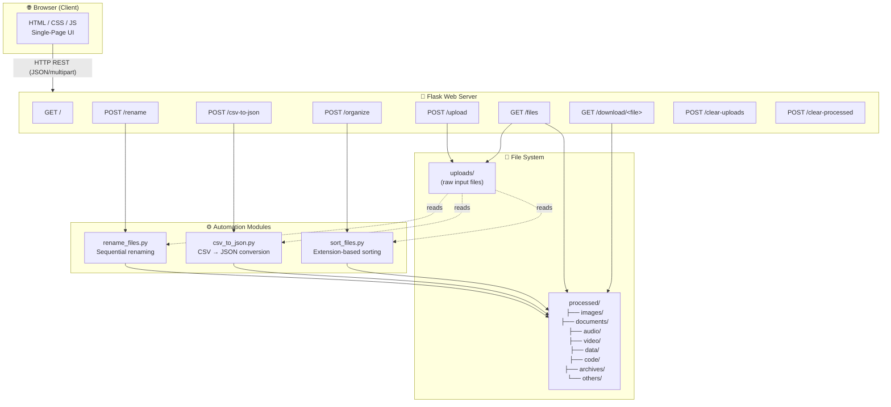
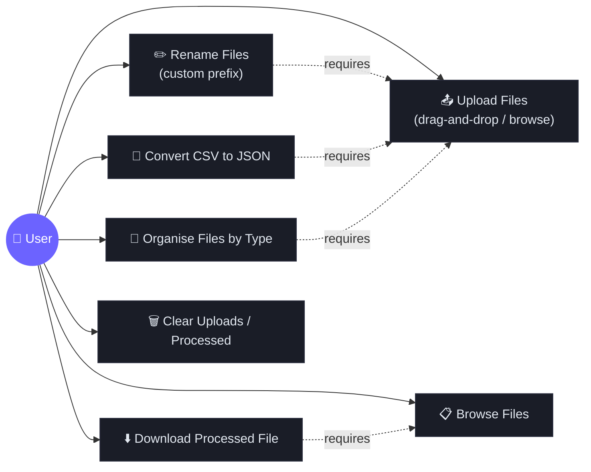
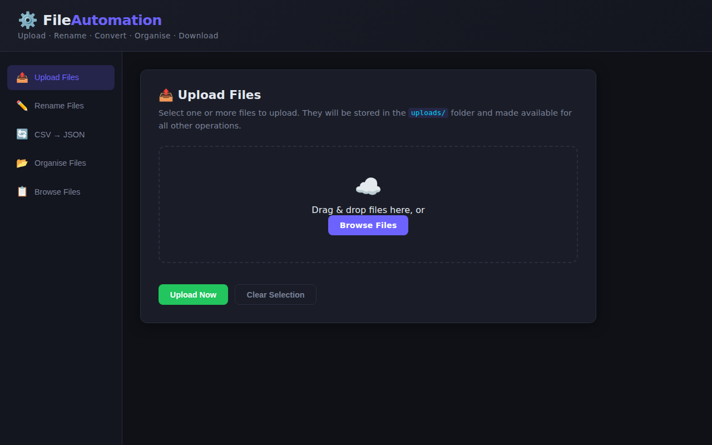
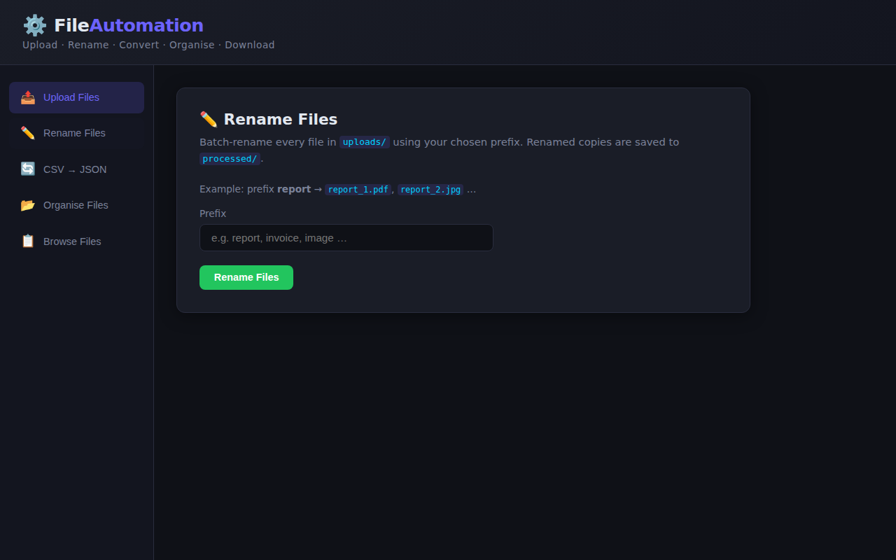
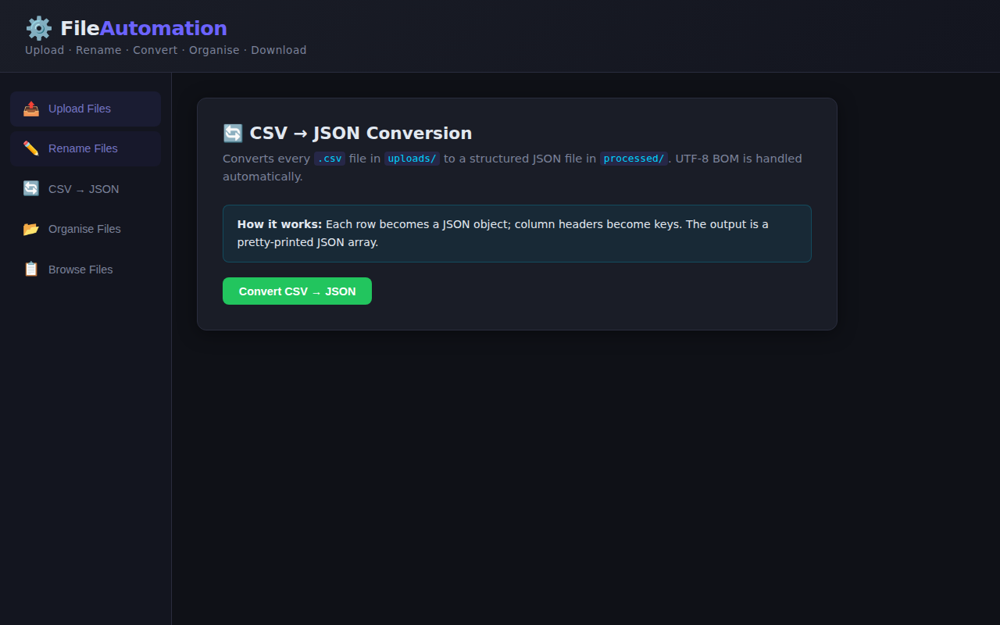
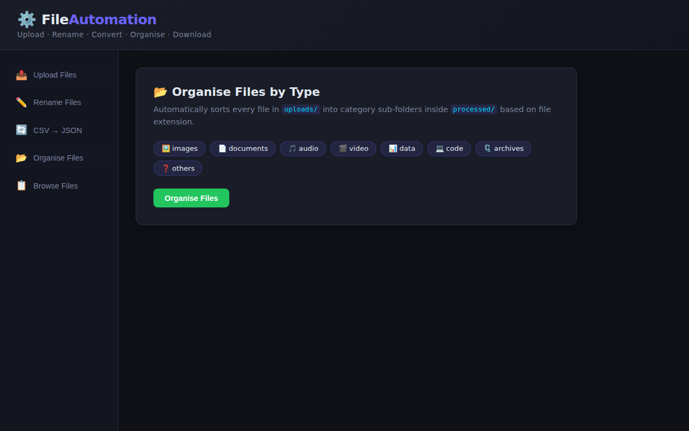
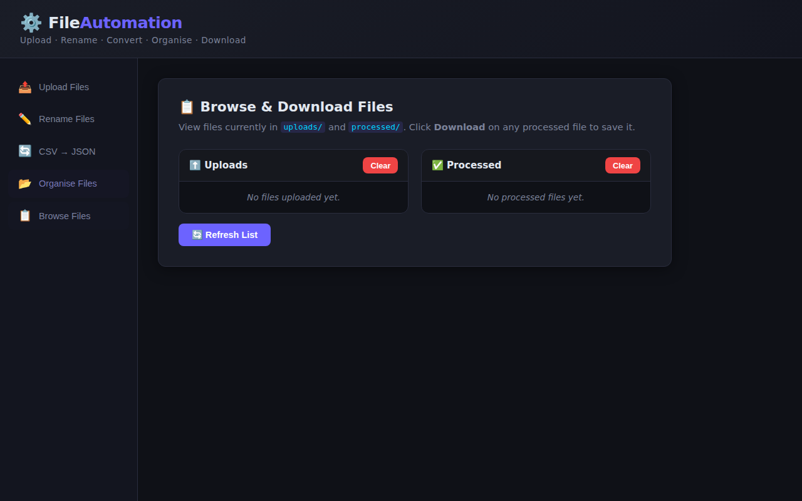

# ⚙️ Python File Automation

A browser-based file automation tool built with **Python + Flask** that lets you upload, rename, convert, organise, and download files — all from a sleek dark-themed web UI.

---

## 📑 Table of Contents

- [Features](#-features)
- [System Architecture](#-system-architecture)
- [Use Case Diagram](#-use-case-diagram)
- [Screenshots](#-screenshots)
- [Tech Stack](#-tech-stack)
- [Getting Started](#-getting-started)
- [API Reference](#-api-reference)
- [Project Structure](#-project-structure)

---

## ✨ Features

| Feature | Description |
|---|---|
| 📤 **Upload Files** | Drag-and-drop or browse to upload one or more files |
| ✏️ **Rename Files** | Batch-rename uploaded files with a custom prefix (`prefix_1.ext`, `prefix_2.ext`, …) |
| 🔄 **CSV → JSON** | Convert every `.csv` file into a pretty-printed `.json` file automatically |
| 📂 **Organise Files** | Sort files into category sub-folders (`images/`, `documents/`, `audio/`, `video/`, `data/`, `code/`, `archives/`, `others/`) |
| 📋 **Browse & Download** | View uploaded and processed files; download any processed file with one click |
| 🗑️ **Clear Folders** | Clear the uploads or processed folder independently |

---

## 🏗️ System Architecture



---

## 🎯 Use Case Diagram



---

## 🖼️ Screenshots

### 1 · Upload Files

> Drag-and-drop files into the drop zone or browse your filesystem. A live file preview shows selected files before uploading.



---

### 2 · Rename Files

> Enter a prefix and click **Rename Files**. Every file in `uploads/` is copied to `processed/` with the pattern `<prefix>_N.ext`.



---

### 3 · CSV → JSON Conversion

> Click **Convert CSV → JSON** to transform all uploaded `.csv` files into structured, pretty-printed JSON arrays stored in `processed/`.



---

### 4 · Organise Files by Type

> Click **Organise Files** to automatically sort every uploaded file into a named sub-folder inside `processed/` based on its extension.



---

### 5 · Browse & Download Files

> See both `uploads/` and `processed/` content at a glance. Download any processed file with one click.



---

## 🛠️ Tech Stack

| Layer | Technology |
|---|---|
| **Backend** | Python 3, Flask |
| **File handling** | `os`, `shutil`, `csv`, `json` (stdlib) |
| **Frontend** | Vanilla HTML5, CSS3 (custom dark theme), JavaScript (Fetch API) |
| **Security** | `werkzeug.utils.secure_filename`, path-traversal guard on downloads |

---

## 🚀 Getting Started

### Prerequisites

- Python 3.9+
- pip

### Installation

```bash
# 1 · Clone the repository
git clone https://github.com/22MH1A42G1/Python-File-Automation.git
cd Python-File-Automation/file_automation_web

# 2 · Install dependencies
pip install -r requirements.txt

# 3 · Run the development server
python app.py
```

Open your browser at **http://127.0.0.1:5000** 🎉

### Dependencies (`requirements.txt`)

```
flask
werkzeug
pandas
```

---

## 📡 API Reference

| Method | Endpoint | Description |
|---|---|---|
| `GET` | `/` | Serve the web UI |
| `POST` | `/upload` | Upload one or more files (multipart form) |
| `GET` | `/files` | List files in `uploads/` and `processed/` |
| `POST` | `/rename` | Rename files — body: `{"prefix": "my_prefix"}` |
| `POST` | `/csv-to-json` | Convert all CSV files in uploads to JSON |
| `POST` | `/organize` | Organise files into category sub-folders |
| `GET` | `/download/<path:filename>` | Download a processed file |
| `POST` | `/clear-uploads` | Delete all files from `uploads/` |
| `POST` | `/clear-processed` | Delete all files/folders from `processed/` |

---

## 📁 Project Structure

```
Python-File-Automation/
└── file_automation_web/
    ├── app.py                   # Flask application & route definitions
    ├── requirements.txt         # Python dependencies
    ├── automation/
    │   ├── __init__.py
    │   ├── rename_files.py      # Batch-rename logic
    │   ├── csv_to_json.py       # CSV → JSON conversion logic
    │   └── sort_files.py        # Extension-based file organiser
    ├── static/
    │   ├── style.css            # Dark-theme stylesheet
    │   └── script.js            # Frontend JS (Fetch API interactions)
    └── templates/
        └── index.html           # Single-page application template
```

---

## 📂 File Category Mapping

| Category | Extensions |
|---|---|
| 🖼️ images | `.jpg` `.jpeg` `.png` `.gif` `.bmp` `.svg` `.webp` `.tiff` |
| 📄 documents | `.pdf` `.doc` `.docx` `.txt` `.xls` `.xlsx` `.ppt` `.pptx` `.odt` |
| 🎵 audio | `.mp3` `.wav` `.aac` `.flac` `.ogg` `.m4a` `.wma` |
| 🎬 video | `.mp4` `.avi` `.mov` `.mkv` `.wmv` `.flv` `.webm` |
| 📊 data | `.csv` `.json` `.xml` `.sql` `.db` `.sqlite` |
| 💻 code | `.py` `.js` `.ts` `.html` `.css` `.java` `.cpp` `.c` `.go` `.rb` |
| 🗜️ archives | `.zip` `.rar` `.tar` `.gz` `.7z` `.bz2` |
| ❓ others | Everything else |

---

## 🪪 License

This project is open source. Feel free to use, modify, and distribute.
